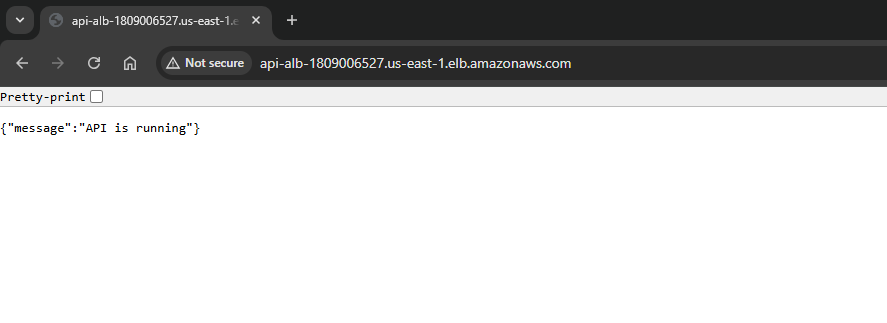
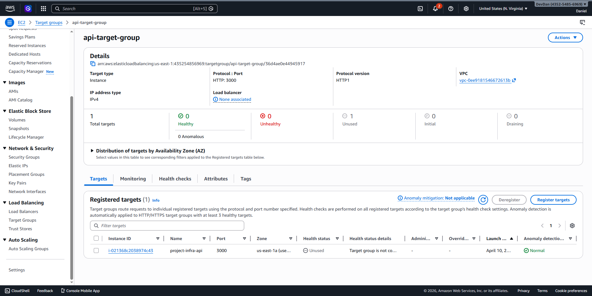

#  Cloud REST API on AWS (Production-Style Deployment)

##  Overview

This project demonstrates deploying a production-style Node.js REST API on AWS using Infrastructure as Code (Terraform).

The system is designed to reflect how backend services are exposed publicly through a load balancer, with proper networking, health checks, and traffic routing.

---

##  Architecture Overview

### Request Flow

Client → Load Balancer → Application Server → Response

---

### Architecture Diagram
            ┌───────────────┐
            │    Client     │
            │ (Browser/API) │
            └──────┬────────┘
                   │ HTTP Request
                   ▼
        ┌────────────────────────┐
        │ Application Load       |
        | Balancer (HTTP :80)    │
        └────────┬───────────────┘
                 |
                 ▼
        ┌────────────────────────┐
        │    Target Group        |
        |   (Health Checks)      │
        └────────┬───────────────┘
                 │
                 ▼
        ┌────────────────────────┐
        │   EC2 Instance         │
        │    (Port 3000)         │
        └────────┬───────────────┘
                 │
                 ▼
        ┌────────────────────────┐
        │   Node.js REST API     |
        |      (Express)         │
        └────────────────────────┘

---

## Live Endpoint

http://api-alb-2009669405.us-east-1.elb.amazonaws.com

---

##  Tech Stack

- Cloud: AWS (EC2, ALB, Target Group, VPC, IAM, CloudWatch)
- Backend: Node.js (Express)
- Infrastructure as Code: Terraform
- CI/CD: GitHub Actions
- Monitoring: CloudWatch

---

##  Project Structure

cloud-rest-api/
│
├── app/                  # Node.js API
│   ├── routes/
│   ├── middleware/
│   ├── server.js
│   └── package.json
│
├── infra/ (or terraform/)
│   ├── vpc.tf
│   ├── ec2.tf
│   ├── alb.tf
│   ├── variables.tf
│   ├── outputs.tf
│
├── docs/
│   └── images/
│       ├── alb-api-response.png
│       ├── target-group-healthy.png
│       ├── ec2-instance-running.png
│
├── README.md 
└── .gitignore

---

##  Infrastructure Design

### Networking

Custom VPC: 10.0.0.0/16
Two public subnets across different Availability Zones
Internet Gateway for outbound access
Route table configured for public traffic

### Compute
EC2 instance running Node.js API
Security group allows:
SSH (restricted)
HTTP (80)
App traffic (3000)

### Load Balancing

Application Load Balancer (ALB)
Listener on port 80
Routes traffic to target group
Target group forwards to EC2 on port 3000
Health checks configured on /

---

## Request Flow

Client sends HTTP request to ALB
ALB receives traffic on port 80
ALB forwards request to target group
Target group selects healthy EC2 instance
Request hits Node.js app on port 3000
Response is returned to client

---

## Screenshots

### ALB Response

### Target Group Health

---

## Key Engineering Decisions

1. Multi-AZ Subnets

The ALB is deployed across two availability zones to satisfy AWS requirements and improve availability.

2. Load Balancer over Direct EC2 Exposure

Instead of exposing EC2 directly, ALB is used to:

Provide a stable public entry point
Enable scaling later (multiple instances)
Perform health checks
3. Health Checks

Target group health checks ensure traffic is only routed to healthy instances.

---

## Debugging (Real Issue Encountered)

### Problem

ALB returned 502 Bad Gateway

Investigation
Checked target group → instance was unhealthy
Tested EC2 locally → app not responding on port 3000
Root Cause

Node.js application was not running on the EC2 instance

### Fix

Started the application manually:

node server.js

Verified with:

curl http://localhost:3000
Target group became healthy

---

## Local Development

cd app
npm install
node server.js

## Infrastructure Deployment

cd project-infra
terraform init
terraform plan
terraform apply

---

## Deployment Architecture

- CI/CD: GitHub Actions (SSH-based deployment)
- Compute: AWS EC2 (Node.js application)
- Process Manager: PM2 (with startup configuration)
- Load Balancer: AWS Application Load Balancer (ALB)
- Health Checks: `/health` endpoint for target group monitoring

---

## Health Check Design

A dedicated `/health` endpoint is implemented to provide a stable and minimal signal for infrastructure monitoring.

- Returns HTTP 200 with application status
- Includes process uptime for basic observability
- Used by ALB target group to determine instance health
- Decoupled from business logic to avoid false negatives

---

## Limitations

- No HTTPS (TLS) configured (HTTP only)
- Single EC2 instance (no Auto Scaling Group yet)
- No centralized logging/monitoring (e.g., CloudWatch integration incomplete)
- No zero-downtime deployment strategy (basic restart via PM2)

---

## Next Improvements

- Add HTTPS using ACM + Application Load Balancer
- Introduce Auto Scaling Group for horizontal scaling
- Implement centralized logging with AWS CloudWatch
- Improve deployment strategy (rolling or blue-green deployments)
- Add monitoring and alerting (CloudWatch alarms)

---

##  Security Approach

- IAM roles instead of access keys
- Least privilege access model
- Security groups controlling traffic
- No secrets stored in code

---

##  Setup Instructions

### Clone Repository

git clone https://github.com/Daniel-Williams-ux/cloud-rest-api.git

cd your-repo

---

### Configure AWS

aws configure

---

### Deploy Infrastructure

cd terraform
terraform init
terraform apply

---

### Run Locally (Optional)

cd app
npm install
npm run dev

---

##  Health Check

GET /health

Response:

{
"status": "ok"
}

---
##  Author

Daniel Williams  
Cloud Engineer | Backend Developer  

---